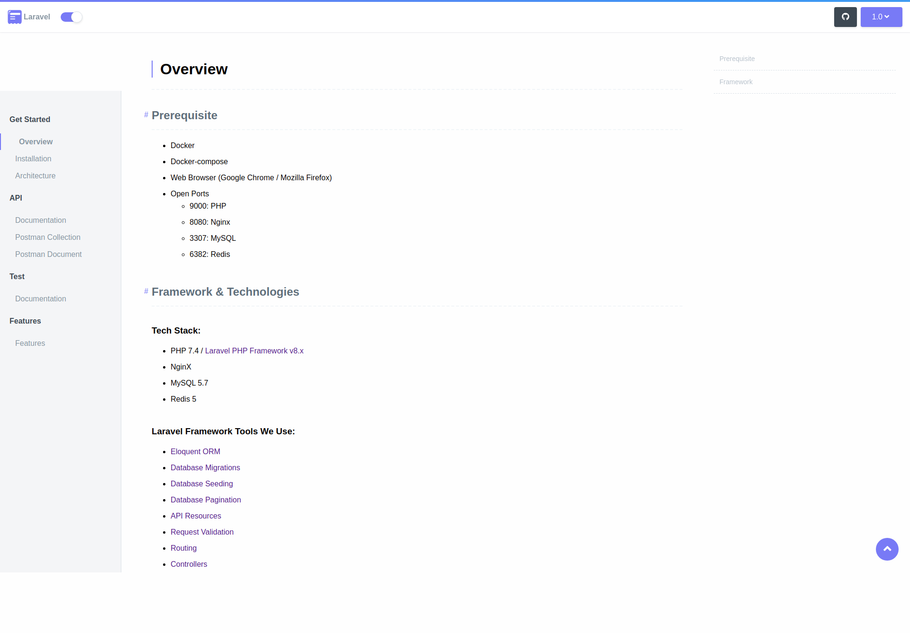

# THE CHALLENGE

Intro: Requirement is give out promo codes worth x amount during events so people can get free rides to and from the event. The flaw with that is people can use the promo codes without going to the event.
Task: Implement a Promo code API with the following features.

- Generation of new promo codes for an event
- The promo code is worth a specific amount of ride
- The promo code can expire
- Can be deactivated
- Return active promo codes
- Return all promo codes
- Only valid when user’s pickup or destination is within x radius of the event venue
- The promo code radius should be configurable
- To test the validity of the promo code, expose an endpoint that accepts origin, destination, the promo code.
- The API should return the promo code details and a polyline using the destination and origin if the promo code is valid and an error otherwise.


Please submit the code as if you intended to ship it to production. The details matter. Tests are expected, as is well written, simple idiomatic code.

---

## Prerequisite

---

- Docker
- Docker-compose
- Web Browser (Google Chrome / Mozilla Firefox) 
- Open Ports
    - 9000: PHP
    - 8080: Nginx
    - 3307: MySQL

## Framework & Technologies
---

### Tech Stack:
- PHP 7.4 / [Laravel PHP Framework v8.x](http://laravel.com/)
- NginX
- MySQL 5.7
- Redis 5

### Laravel Framework Tools We Use:
- [Eloquent ORM](https://laravel.com/docs/8.x/eloquent)
- [Database Migrations](https://laravel.com/docs/8.x/migrations)
- [Database Seeding](https://laravel.com/docs/8.x/seeding)
- [Database Pagination](https://laravel.com/docs/8.x/pagination)
- [API Resources](https://laravel.com/docs/8.x/eloquent-resources)
- [Request Validation](https://laravel.com/docs/8.x/validation)
- [Routing](https://laravel.com/docs/8.x/routing)
- [Controllers](https://laravel.com/docs/8.x/controllers)

# Installation

---

- [Install](/{{route}}/{{version}}/installation#install)
- [View](/{{route}}/{{version}}/installation#view)

## Install (Using Docker) - Single command setup

Install via MakeFile

```shell script
make deploy
```

This command will do following things:
- Set Environment Variables
- Run Docker Services
- Waits until MySQL Service starts
- Generate API Key
- Generate MySQL Schema and Default Database Data Entries

Output:


## No Docker? No Problem. Install Without Docker
Copy Make env file from .env.example
```
> cp .env.example .env
```

#### Database Configuration

Add database credentials in the `.env` file

```
> composer install
> php artisan key:generate
> php artisan migrate:fresh --seed
> php artisan serve --port=8080
```


## View

Open [http://localhost:8080](http://localhost:8080)

## View Documentation

Open [http://localhost:8080/docs](http://localhost:8080/docs)



## Contact 
* Find me on Github at [@kavanpancholi](https://github.com/kavanpancholi)
* Email <kavanpancholi@gmail.com>
